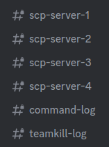

# SCPDiscord     
SCPDiscord is a very customisable Discord bot + SCP:SL plugin combo which lets you monitor and manage your SCP:SL servers from Discord.

## Download
You can download the latest release [here](https://github.com/KarlOfDuty/SCPDiscord/releases) or the latest dev build [here](https://jenkins.karlofduty.com/blue/organizations/jenkins/NWAPI%2FSCPDiscord/activity).

## Guides
- [Installation and configuration](docs/Installation.md)

- [Editing messages and languages](docs/Languages.md)

- [Commands](docs/Commands.md)

- [Building SCPDiscord](docs/Building.md)

## Main features

### Event logging
Northwood API events such as round starting, player kills, admin commands and many more can be logged to a Discord channel. All are optional and can be toggled individually.

### Multi-channel support
Individual events can be configured to post to different and multiple Discord channels. In the example setup below players can see basic logs from each individual server while staff also have a command log and teamkill log showing events from all four servers.

### MultiAdmin servers
Each sub-server of a MultiAdmin server can post to the same channel, different channels or even different Discord servers. They work just like individual SCP:SL servers.

### Running server commands
You can use server and remote admin commands via the bot, with command permissions limited to specific roles of your choice.

### Extra commands
The bot also comes with a few extra commands such as playerinfo, improved ban/unban, and improved mute/unmute commands which all also work on offline players.

More information about bot commands are available [here](docs/Commands.md).

### Languages and messages
There are several languages to choose from and every single individual message can also be edited separately from the language settings using the `overrides.yml` and optionally `emote-overrides.yml` files. More info [here](docs/Languages.md).

### Bot activity info
Player count is displayed in the bot activity field. The bot's status changes from red when the scp server is off but the bot server is on, yellow when there are no players on a server and green when a server has players.

The activity text can also be customised in the language or overrides file.

### Role and reserved slot syncing
The role sync system lets you execute any command when a player joins depending on their current Discord role.

You can grant reserved slots automatically for specific Discord roles, and automatically remove them if they lose their Discord role.

The plugin also includes commands to grant temporary in-game server ranks, which handles automatically granting and revoking in-game ranks when they are granted and revoked in Discord.

### Playtime tracking
The plugin optionally tracks players play time on the servers which can be viewed using the `/playerinfo` command.